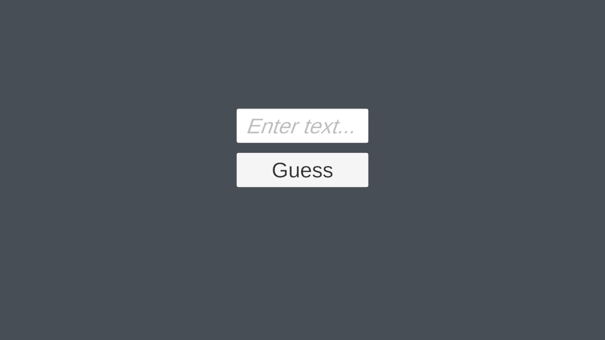

# Guess the Number Game

This project is a simple "Guess the Number" game developed in Unity using C#. The user tries to guess a randomly generated number within a specified range. After each guess, feedback is provided to help guide the player towards the correct number.

## Features
- **User Input**: Players enter their guesses using a UI input field.
- **Random Number Generation**: A new random number is generated each time the game resets.
- **Feedback Messages**: Feedback is provided on each guess, indicating whether the player should guess higher or lower.
- **Game Reset**: On winning, the game resets, allowing the player to try guessing a new number.

## How to Play
1. Enter a number in the input field and click the button to submit your guess.
2. Feedback will display based on your guess:
   - **Correct!** – If the guess matches the random number.
   - **Try Lower** – If the guess is too high.
   - **Try Higher** – If the guess is too low.
3. After a correct guess, the game resets for a new round.

## Dependencies
- [TextMeshPro](https://docs.unity3d.com/Packages/com.unity.textmeshpro@latest) for text rendering and input handling in Unity.

## Setup in Unity
1. Import the `GameLogic.cs` script into your Unity project.
2. Add `TMP_InputField`, `TMP_Text`, and `Button` UI components to your scene.
3. Link these components in the `GameLogic` script within the Unity Inspector.
4. Set `randomNumMin` and `randomNumMax` in the Inspector to define the guessing range.

## Screenshot

